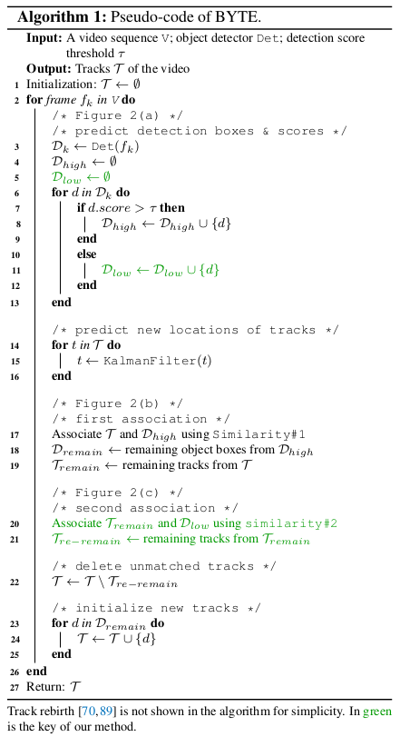

## Introduction

Following are my notes on BYTE, simple and effective association method. Proposed in paper *ByteTrack: Multi-Object Tracking by Associating Every Detection Box*.

## BYTE, The Algo?

- For each frame in the video, we predict the detection boxes and scores using the detector **Det**.
- We separate all the detection boxes **Dboxes** into two parts **Dhigh** and **Dlow** according to the detection score threshold **τ**.
- detection boxes, **Dboxes** > **τ** stored into **Dhigh**
- detection boxes, **Dboxes** < **τ** stored into **Dlow**
- Use **Kalman Filter** to predict new location in current frame for each track in **T**;
- First association is performed between **Dhigh** and all the tracks **T** (including the lost tracks **Tlost** ) using `Similarity #1`.
- `Similarity #1` can be computed either by the **IoU** or the **Re-ID** feature distances between the **Dhigh** and the predicted box of tracks **T**.
- Next, we adopt **Hungarian Algorithm** to finish the matching based on the similarity.
- We keep the unmatched detections in **Dremain** and the unmatched tracks in **Tremain**.
- Second association is performed between the low score detection boxes **Dlow** and the remaining tracks **Tremain** after the first association.
- We keep the unmatched tracks in **Tre-remain** and just delete all the unmatched low score detection boxes, since we view them as background.
- We find it important to use **IoU** alone as the `Similarity #2` in the second association because the low score detection boxes usually contains severe occlusion or motion blur and appearance features are not reliable.
- For the unmatched tracks **Tre-remain** after the second association, we put them into **Tlost**.
- For each track in **Tlost** , only when it exists for more than a certain number of frames, i.e. 30, we delete it from the tracks **T** . Otherwise, we remain the lost tracks **Tlost** in **T**.
- Finally, we initialize new tracks from the unmatched high score detection boxes **Dremain** after the first association.
- The output of each individual frame is the bounding boxes and identities of the tracks **T** in the current frame.
    