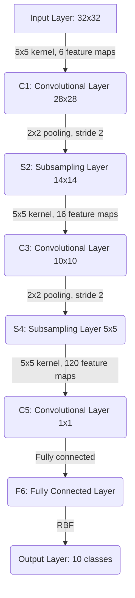

## Paper

- **Paper Name**: [Gradient-Based Learning Applied to Document Recognition](http://vision.stanford.edu/cs598_spring07/papers/Lecun98.pdf)
- **Authors**: Yann LeCun, Leon Bottou, Yoshua Bengio, and Patrick Haffner

## LeNet:
- LeNet-5 is a pioneering convolutional neural network (CNN) that played a foundational role in the field of deep learning, particularly in the application of using deep learning to image recognition tasks.
- Key Contributions:
  - Conv Layer: Demonstrated the effectiveness of using learnable filters for feature extraction from images.
  - Subsampling/Pooling Layer: Introduced the concept of spatial pooling (also known down-sampling) to reduce the spatial size of the representation, control overfitting, and reduce computational requirements.
  - One more aspect about LeNet-5 regarding activations is that,
    - for intermediate layers it used tanh
    - for final output layer radial basis function (RBF) network to classify images.
- Architecture: LeNet-5's architecture is relatively simple by today's standards but was revolutionary at the time. It consists of the following layers,

| Layer | Layer Type                | # of filters | Feature-Map Size | Kernel Size |
|-------|---------------------------|-------------------|------------------|-------------|
|       | Input Layer               | N/A               | 32x32            | N/A         |
| C1    | Convolutional Layer       | 6                 | 28x28            | 5x5         |
| S2    | Subsampling (Pooling) Layer| 6                 | 14x14            | 2x2         |
| C3    | Convolutional Layer       | 16                | 10x10            | 5x5         |
| S4    | Subsampling (Pooling) Layer| 16                | 5x5              | 2x2         |
| C5    | Convolutional Layer       | 120               | 1x1              | 5x5         |
| F6    | Fully Connected Layer     | N/A               | N/A              | N/A         |
|       | Output Layer              | N/A               | N/A              | N/A         |
---

