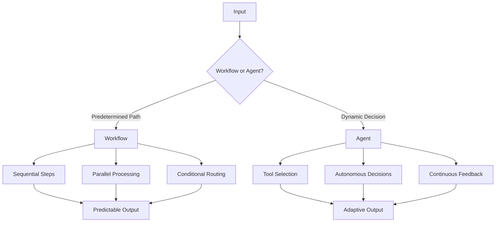
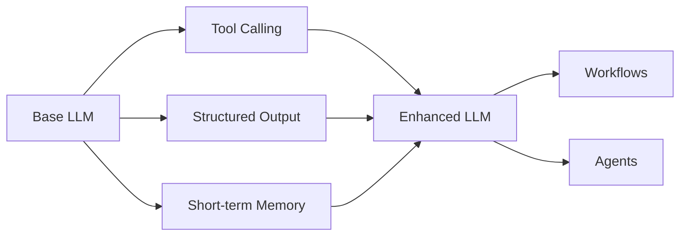
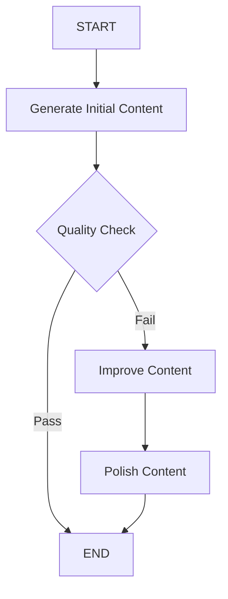
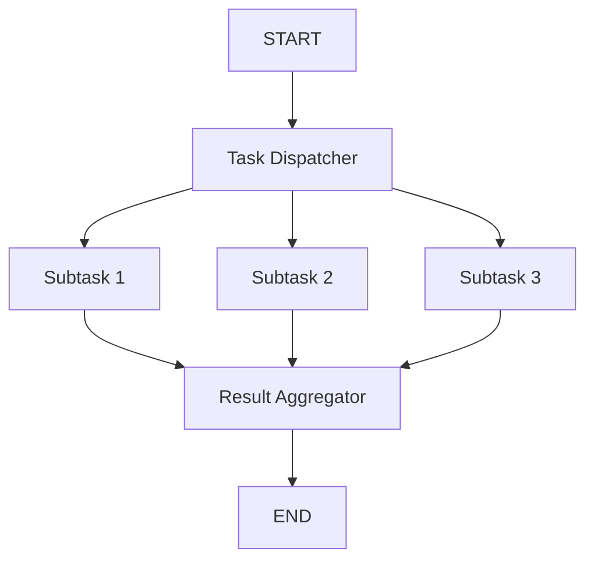
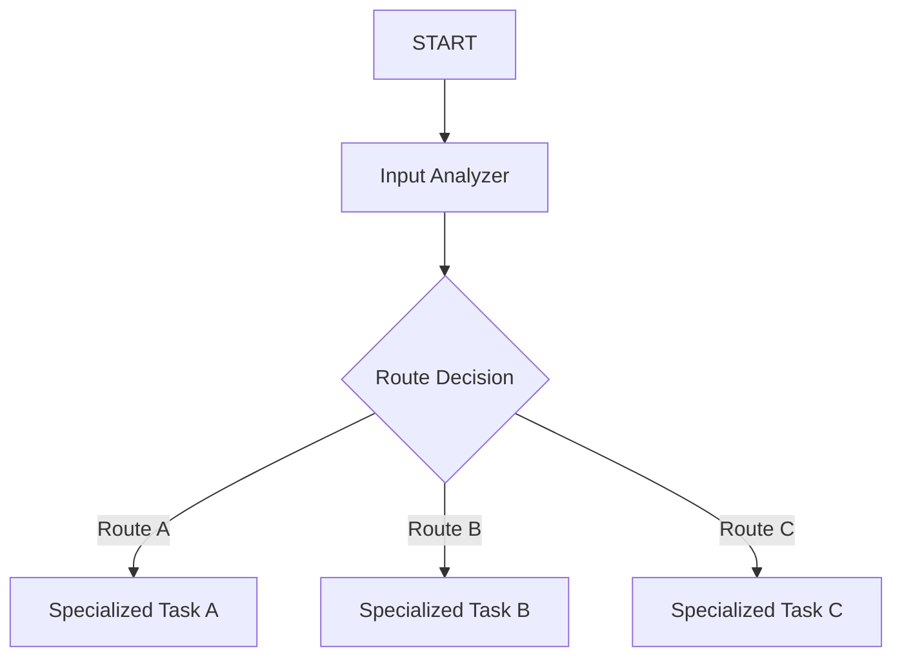
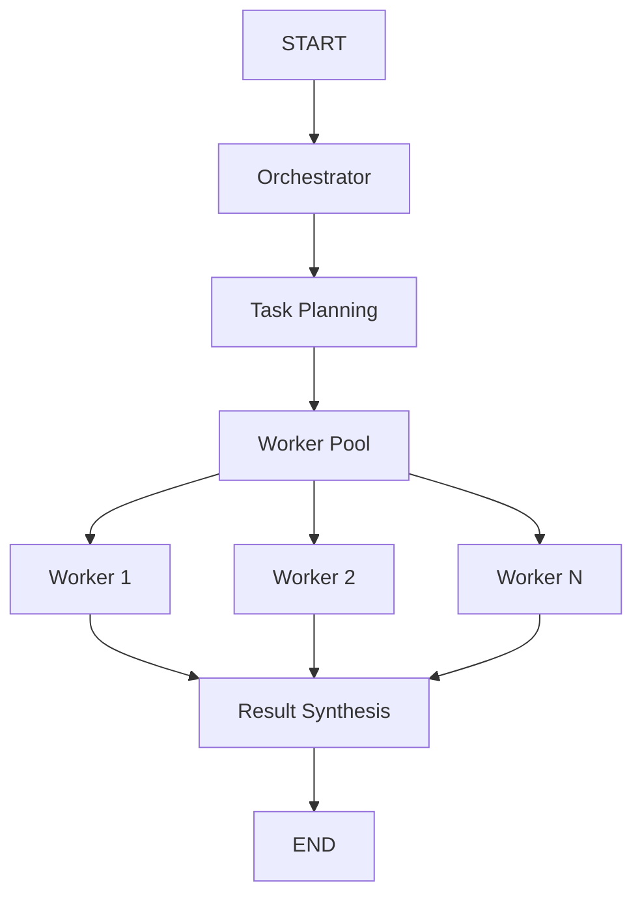
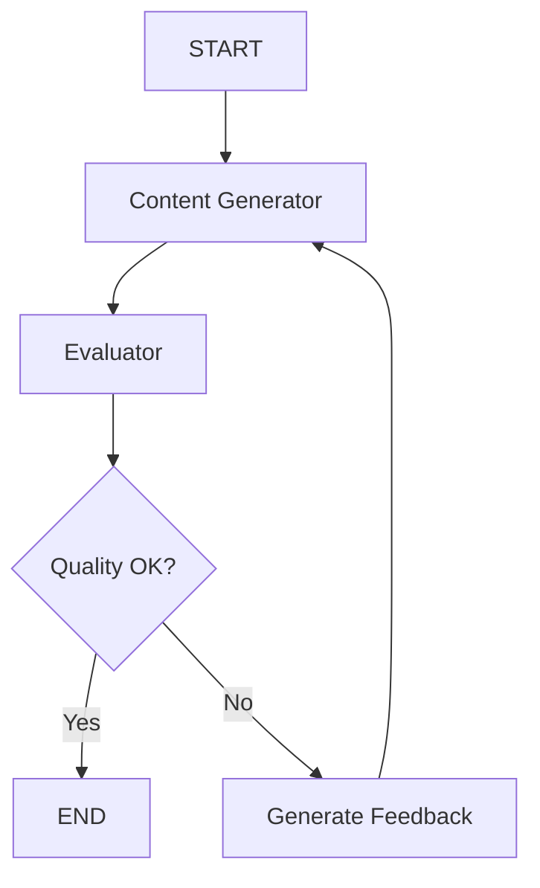
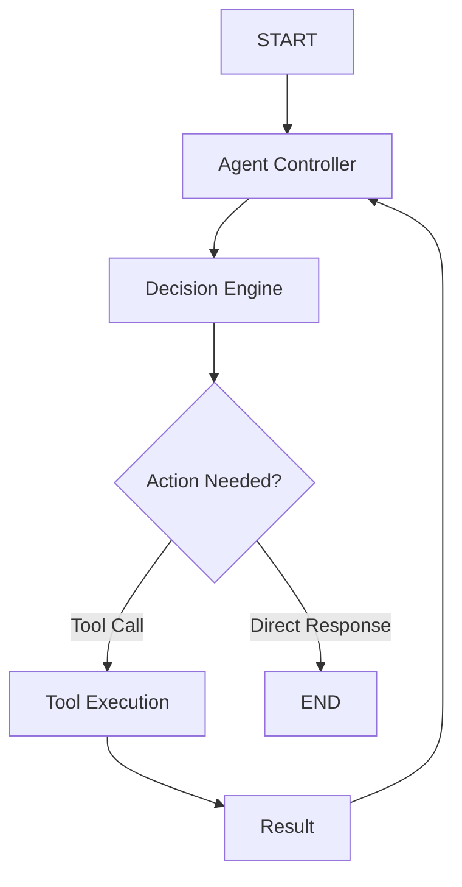
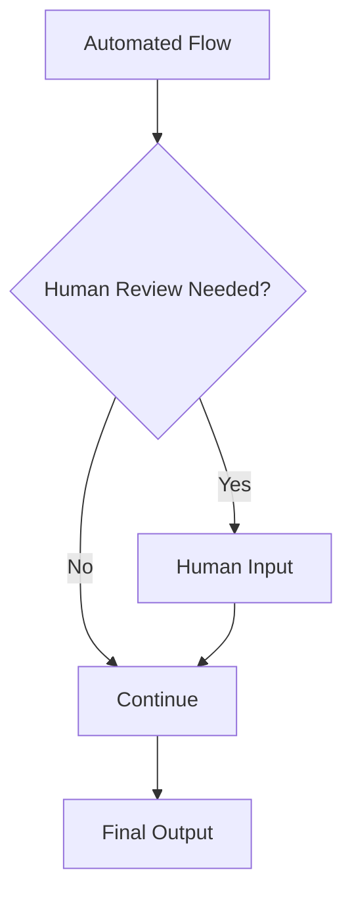

## Overview  
This guide explores how intelligent systems can be structured using **workflows** (deterministic flows) and **agents** (autonomous decision-makers).  
Workflows ensure reproducible outcomes, while agents enable adaptability, reasoning, and context awareness in dynamic environments.  

**Key Distinctions:**  
- **Workflows:** Predetermined logic and fixed execution order.  
- **Agents:** Goal-driven, dynamic routing with tool and state awareness.  

---

## LLM Augmentations

LLMs can be enhanced with structured reasoning, tool usage, and memory — transforming them from passive responders into dynamic reasoning engines capable of driving workflows or agentic behavior.

---

## 1. Prompt Chaining Pattern

Used for **deterministic multi-step tasks** where each stage refines or validates the previous output — ensuring controlled, progressive improvement.

**Highlights:**
Sequential flow with feedback gates and quality validation loops.
Useful for iterative content, code, or data enrichment pipelines.

---

## 2. Parallelization Pattern

Ideal for tasks that are **independent** and can be executed simultaneously to improve performance and scalability.

**Highlights:**
Enables concurrency by distributing workloads and merging partial outcomes.
Effective for large-scale document processing or data analysis.

---

## 3. Routing Pattern

A **decision-based** pattern where inputs are classified and directed to specialized branches, ensuring the right logic handles each case.

**Highlights:**
Implements contextual awareness via intelligent routing logic.
Ideal for multi-domain or customer-facing systems.

---

## 4. Orchestrator-Worker Pattern

A scalable architecture where an **orchestrator decomposes** complex goals into smaller subtasks and distributes them among specialized workers.

**Highlights:**
Promotes modularity and horizontal scaling.
Workers handle specific subtasks while the orchestrator manages coordination and result aggregation.

---

## 5. Evaluator-Optimizer Pattern

An iterative **feedback-driven** design that improves quality by alternating between generation and evaluation phases until convergence.

**Highlights:**
Combines evaluation and generation in cycles to achieve optimal outcomes.
Ideal for quality-sensitive tasks such as code, content, or design generation.

---

## 6. Agent Pattern

The **most autonomous** structure where agents reason, choose tools, and act based on evolving context without predefined control flow.

**Highlights:**
Designed for dynamic decision-making and adaptive responses.
Ideal for reasoning, information retrieval, or self-directed problem-solving systems.

---

## Pattern Selection Matrix

| Pattern             | Predictability | Complexity | Parallelization | Autonomy |
| ------------------- | -------------- | ---------- | --------------- | -------- |
| Prompt Chaining     | High           | Low        | No              | Low      |
| Parallelization     | High           | Medium     | Yes             | Low      |
| Routing             | Medium         | Medium     | No              | Low      |
| Orchestrator-Worker | Medium         | High       | Yes             | Medium   |
| Evaluator-Optimizer | Medium         | Medium     | No              | Medium   |
| Agent               | Low            | High       | Conditional     | High     |

---

## Advanced Integrations

### Hybrid Patterns

Combine multiple paradigms for adaptive intelligence:

* Router + Orchestrator-Worker → domain-specific task routing with distributed execution.
* Agent + Evaluator-Optimizer → self-learning, self-correcting intelligent systems.

### Human-in-the-Loop

Integrate human oversight for ethical control, compliance, or quality assurance.

---

## Conclusion

Workflow and agent patterns form the building blocks for **reliable, scalable, and adaptive AI systems**.
Select patterns based on **task complexity**, **autonomy**, and **performance needs**, and extend them with hybrid or human-in-loop approaches for production-grade applications.
