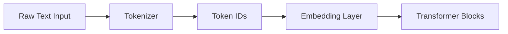
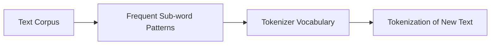
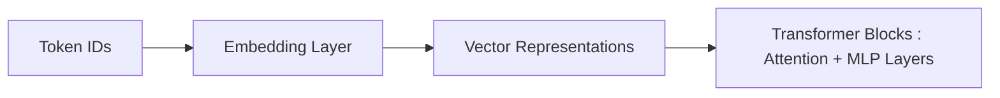

# What is Tokenization & Why LLMs Don't See Words
>"Everything should be made as simple as possible, but not simpler."
>— Albert Einstein

Large Language Models(LLMs) appear to read and write words, sentences and even paragraphs fluently. But internally, **they never see words at all**.

They see **tokens**.

Understanding tokenization is the first and most important step when learning how llms actually work. Almost every downstream concept -- cost, latency, multilingual bias, hallucinations and even reasoning quality -- is influenced by this single design choice.

*In this post am trying to answer below questions:*
1. *What is tokenization?*
2. *Why LLMs don't operate on words?*

## The illusion: "LLMs Understand Words"

When you type this sentence
> LLMs are amazing

it looks like a sequence of words.

But for an LLM, this is just a raw text, which is meaningless until converted into numbers.

Its basically because Neural Networks cannot operate on:
- Characters
- Strings
- Words

They only operate on **numbers**.

so the first job of LLMs is to convert text --> numbers.

that conversion process is called **tokenization**.

## What is Tokenization?
> Tokenization is the process of converting raw text into a sequence of discrete tokens that can be mapped to numbers.

Each token can be:
- a word
- a part of a word
- a character
- or even a byte

depending on the tokenizer design.

**Example:**

Input Text:

`I love Machine Learning`

Possible Tokenizations:

```[`I`, `love`, `Machine`, `Learning`]```

Mapped to Token IDs:

`[101, 1567, 3456, 7890]`

### High-level LLM input pipeline
Notice how LLMs process text inputs:

Tokenization happens right at the start of the LLM input.

The model never sees raw text, it only sees token IDs.

## Tokens != Words
Most people assume that tokens are just words. But thats not true.

**Example:**
Consider the word: 

`unbelievable`

Possible Tokens:
- `unbelievable` --> 1 token (word-level)
- `un` + `believable` --> 2 tokens (Subword-level)
- `un` + `believe` + `able` --> 3 tokens (Finer subword-level)

All represent the same word, but tokenized differently. This is intentional.

## Why not just use words as tokens?
At first glance, using words as tokens seems natural. However, there are several challenges with word-level tokenization:

### Problem 1: Vocabulary Explosion
Imagine a word-level vocabulary for English. There are hundreds of thousands of words, including 
- every verb tense
- plurals
- names
- slangs

**Example**: 

```running, ran, runs, runner```

Each becomes a separate token. 

Now multiply this across:
- all languages
- all domains (technical, medical, biology, legal etc.)
- all spelling variations

This leads to an enormous vocabulary size, making the model large and inefficient.

### Problem 2: Out-of-Vocabulary (OOV) Words
Suppose the model never saw this word during training:

```electroencephalography```

With word-level tokenization, the model would have no way to represent this unseen word, leading to OOV issues.

With subword tokenization:

```["electro" , "encephalo" , "graphy"]```

### Problem 3: Names, URLs and Code Break everything
Consider this input:

`Visit www.example-site.com for more info!`

Or a variable name in code:

`user_profile_data = fetch_data()`

Here a word based tokenizer fails immediately.

### Problme 4: Multilingual Text
Consider this Marathi sentence:

`मला मशीन लर्निंग आवडते`

There are:
- Many unique words
- Many inflected forms
Here word-level tokenization becomes impractical. Subword tokenization may break it down into manageable pieces.

## The core idea: Subword Tokenization
Modern LLMs use **subword tokenization**.

Instead of treating words as atomic units, subword tokenization breaks texts into frequently occurring pieces.

**Conceptual View:**


Notice how subword tokenization captures common roots, prefixes and suffixes.

**Example:**

``` playing, player, played, playful```

All share the root sub-token:

`play`

This allows:
- parameter sharing
- better generalization
- fewer total tokens

## Token IDs: The Language of the Model

**Input Text:**
`Transformers scale surprisingly well`

**Possible Tokenizations:**
```[`Transform`, `ers`, `scale`, `surprising`, `ly`, `well`]```

**Mapped to Token IDs:**
`[34567, 890, 1234, 5678, 90, 4321]`

At this point:
- meaning = vector relationships
- syntax = positional patterns
- language = statistics

### Inside the model: Numbers Only



The model processes only numbers, never words. All linguistic knowledge is encoded in the learned embeddings and attention patterns.

## Why Tokenization Matters
Tokenization is not just a preprocessing step -- it fundamentally shapes how LLMs behave and generalize across languages and domains.

- **Cost and Latency**
LLMs are billed per token. More tokens = higher cost and slower responses.

- **Multilingual Fairness**
Some Languages require more tokens for the same meaning, making them more expensive and sometimes less accurate.

- **Reasoning Quality**
If a meaningful concept is spilt into many tokens, the model has to "reconstruct" it internally, which can affect reasoning.

- **Model Limits**
Context window limits are measured in tokens, not words. Tokenization decides how much information fits in that window.

## Conclusion
Tokenization is a foundational concept in understanding how LLMs operate. By breaking text into subword tokens, models can efficiently handle vast vocabularies, generalize to unseen words, and process.


